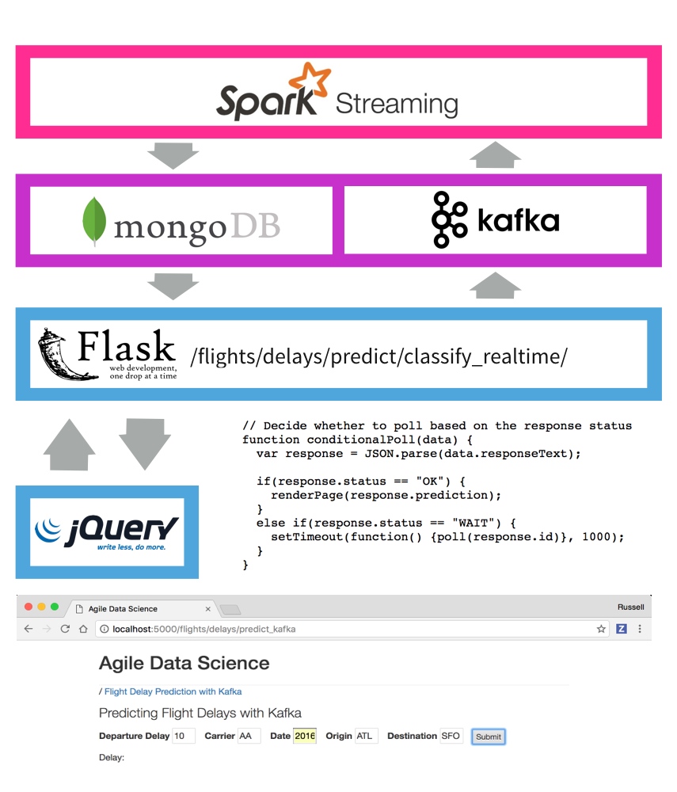

# README

## Agile Workflow for Data-Driven Applications

---

### Data-Driven Application Pyramid

Originally by Pete Warden, the data value pyramid is how the agile worklow is organized and structured. We climb it as we go forward each sprint.

---

### System Architecture

The following diagrams are pulled from our typical workflow, and express the basic concepts in the system architecture.
The front and back end architectures work together to make a complete predictive system.

#### Front End Architecture

This diagram shows how the front end architecture works in the demo flight delay prediction application.
1. The user fills out a form with some basic information in a form on a web page, which is submitted to the server.
2. The server fills out some neccesary fields derived from those in the form like "day of year" and emits a Kafka message containing a prediction request.
3. Spark Streaming is listening on a Kafka queue for these requests, and makes the prediction, storing the result in MongoDB.
4. Meanwhile, the client has received a UUID in the form's response, and has been polling another endpoint every second.
5. Once the data is available in Mongo, the client's next request picks it up.
6. Finally, the client displays the result of the prediction to the user!

#### Back End Architecture

The back end architecture diagram shows how we train a classifier model using historical data on disk.
1. To predict flight delays in batch in Spark. We save the model to disk when it is ready.
2. Next, we launch Zookeeper and a Kafka queue. We use Spark Streaming to load the classifier model, and then listen for prediction requests in a Kafka queue.
3. When a prediction request arrives, Spark Streaming makes the prediction, storing the result in MongoDB where the web application can pick it up.

This architecture is extremely powerful, and it is a huge benefit that we get to use the same code in batch and in realtime with PySpark Streaming.

---
